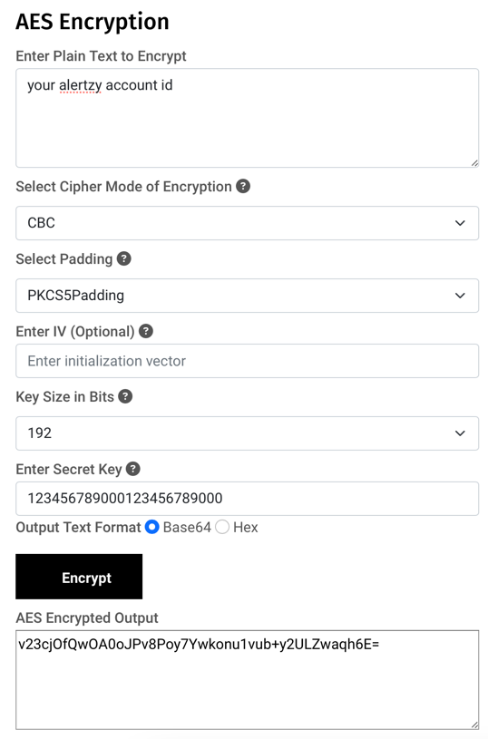

# stocklerts: your personal stock price tracker

A Python-based stock price alert tracker that monitors stock prices using Finnhub and sends push notifications via Alertzy based on user-defined thresholds.

## Features

- Monitor multiple stock tickers with percentage-based alert thresholds.
- Send push notifications to configured devices using Alertzy.

## Setup

### Prerequisites

- Python 3.7+
- Poetry

### Installation

1. **Clone the Repository**

    ```bash
    git clone https://github.com/vinaykudari/stocklerts.git
    cd stocklerts
    ```

2. **Install Dependencies**

    ```bash
    poetry install
    ```

3. **Configure Environment Variables**

    Register at [finnhub](https://finnhub.io) and set the key:

    ```dotenv
    FINNHUB_API_KEY=<your_finnhub_api_key_here>
    ```
   
   Encrypt your Alertz account id at [devglan.com](https://www.devglan.com/online-tools/aes-encryption-decryption) using the exact same settings and set the passcode as env var
   
   
   ```dotenv
    ENCRYPT_KEY=<your_passcode>
   # gail residents use our wifi passsword twice <password><password> to encrypt your account id
    ```

4. **Configure Application**

    Install [Alerty](http://alertzy.app/) app and copy the account id
    and update `config/config.yaml` with your desired settings:

 ```yaml
 defaults:
  cooldown_period_minutes: 60
  max_notifications_per_day: 100
  max_quote_calls_per_min: 60

alertzy:
  accounts:
    - user_id: 1
      account_id: <encrypted_account_id>

    - user_id: 2
      account_id: 18tu6LkU4y9uNArpNlAyog==

tickers:
  - symbol: AAPL
    threshold:
        - value: 5
          users:
            - 1
        - value: 0
          users:
            - 2

  - symbol: MSFT
    threshold:
      - value: 5
        users:
          - 1

  - symbol: GOOGL
    threshold:
      - value: 0
        users:
          - 1

 ```

5. **Run the application**

- Install the dependencies from `webhook_handler_reqs.txt`
- Start the webhook handler (Check at the end to set this as system service)
```bash
gunicorn -b 0.0.0.0:5005 webhook_handler:app
 ```
- Start the app server
 ```bash
 poetry run python -m app.main
 ```

- Alternatively, use docker
 ```bash
 docker compose build 
 # make sure you sent the env vars before you run this
 FINNHUB_API_KEY=$FINNHUB_API_KEY ENCRYPT_KEY=$ENCRYPT_KEY docker compose up
 ```

## CI/CD setup to restart the server when the codebase updates

### **Setup `webhook_handler` as system service**

1. Install `venv` for your python version
```commandline
sudo apt install python3.10-venv
```
2. Create a venv in the directory
```commandline
python3 -m venv venv
```
3. Update the permissions
```commandline
sudo chown -R <username>:<username> /path/to/project/venv
```

4. Create a system service to run the server on boot as daemon

```
sudo vim /etc/systemd/system/stocklerts_webhook_handler.service
```

```commandline
[Unit]
Description=Stocklerts Webhook Handler
After=network.target

[Service]
Type=simple
User=dexter
Group=dexter
WorkingDirectory=/path/to/project
Environment=PATH=/path/to/project/venv/bin:/usr/local/sbin:/usr/local/bin:/usr/sbin:/usr/bin:/sbin:/bin
ExecStartPre=/usr/bin/python3 -m venv venv
ExecStartPre=/path/to/project/venv/bin/pip install -r /path/to/project/webhook_handler_reqs.txt
ExecStart=/path/to/project/venv/bin/gunicorn --bind 0.0.0.0:5005 webhook_handler:app
Restart=on-failure

[Install]
WantedBy=multi-user.target
```
- Update the service
```commandline
sudo systemctl daemon-reload
```

- Start the service
```commandline
sudo systemctl start stocklerts_webhook_handler.service
```

- Enable the service to start at boot
```commandline
sudo systemctl enable stocklerts_webhook_handler
```

- Monitor logs
```commandline
journalctl -u stocklerts_webhook_handler.service -f
```

### **Tunnel `webhook_handler` using `ngrok`**

1. Setup [ngrok account](https://dashboard.ngrok.com/get-started/your-authtoken) and add your config to the file
- Create `ngrok` config file in home directory
```commandline
vim ~/ngrok.yml
```
```commandline
authtoken: <auth-token>
version: 1
tunnels:
  stocklerts:
    proto: http
    addr: 5005
    hostname: <your-static-domain>
```

2. Create a system service to run the server on boot as daemon
```
sudo vim /etc/systemd/system/ngrok_tunnel.service
```
```commandline
[Unit]
Description=Ngrok Tunnel for Stocklerts
After=network.target

[Service]
ExecStart=/snap/bin/ngrok start --config /home/<username>/ngrok.yml stocklerts
Restart=on-failure
User=<username>

[Install]
WantedBy=multi-user.target
```

- Update the service
```commandline
sudo systemctl daemon-reload
```

- Start the service
```commandline
sudo systemctl start ngrok_tunnel.service
```

- Enable the service to start at boot
```commandline
sudo systemctl enable ngrok_tunnel
```
